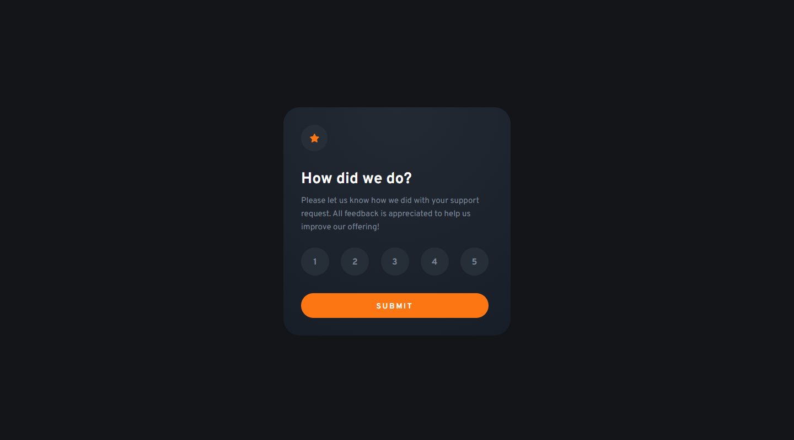

# Frontend Mentor - Interactive card details form solution

This is a solution to the [Interactive rating component](https://www.frontendmentor.io/challenges/interactive-rating-component-koxpeBUmI/hub) 🎉

## Table of contents

- [Overview](#overview)
  - [The challenge](#the-challenge)
  - [In addition](#in-addition)
  - [Links](#links)
- [My process](#my-process)
  - [Built with](#built-with)
- [Author](#author)

## Overview

### The challenge

Your challenge is to build out this interactive rating component and get it looking as close to the design as possible.

You can use any tools you like to help you complete the challenge. So if you've got something you'd like to practice, feel free to give it a go.

Your users should be able to:

- View the optimal layout for the app depending on their device's screen size
- See hover states for all interactive elements on the page
- Select and submit a number rating
- See the "Thank you" card state after submitting a rating

### In addition

- I added cool animation, tell me if you like it 😎

### Links

- Solution URL: [See source code](https://github.com/ClemFRontend/interactive-rating-component)
- Live Site URL: [interactive-rating-component-git-master-clemfrontend.vercel.app](https://interactive-rating-component-git-master-clemfrontend.vercel.app/)

## My process

### Built with

- ⚛️ [React](https://reactjs.org/) - JS library

## Author

- Frontend Mentor - [@ClemFRontend](https://www.frontendmentor.io/profile/ClemFRontend)
