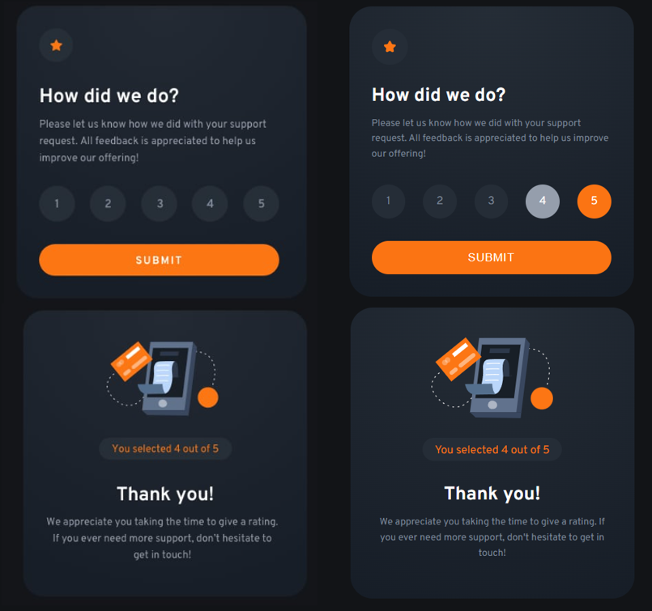

# Frontend mentor interactive-rating-component challenge

This is the [Frontend Mentor](https://www.frontendmentor.io/challenges/interactive-rating-component-koxpeBUmI) challenge called interactive-rating-component.

This project is written in ReactJS and CSS and he was bootstrapped with [Create React App](https://github.com/facebook/create-react-app).

## Result

This next picture is the result of the challenge

> left : design, right : result coded



Some cool animations was added to a better render ✅

## How to start project

In the project directory, you can run:

```
npm start
```

Runs the app in the development mode.\
Open [http://localhost:3000](http://localhost:3000) to view it in your browser.

The page will reload when you make changes.\
You may also see any lint errors in the console.